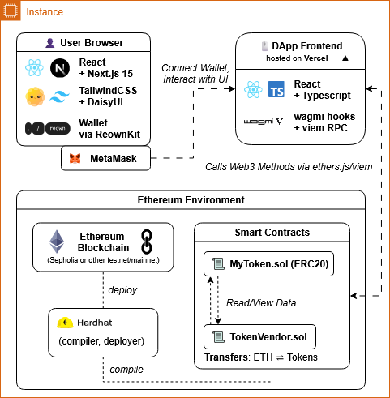
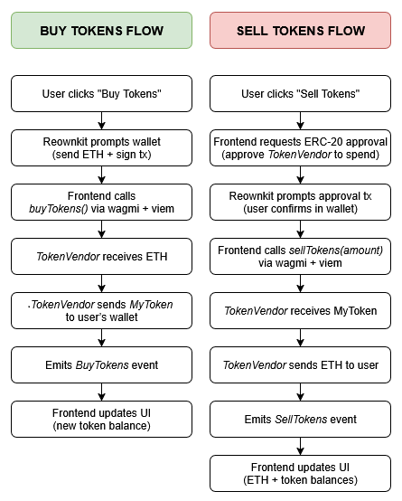
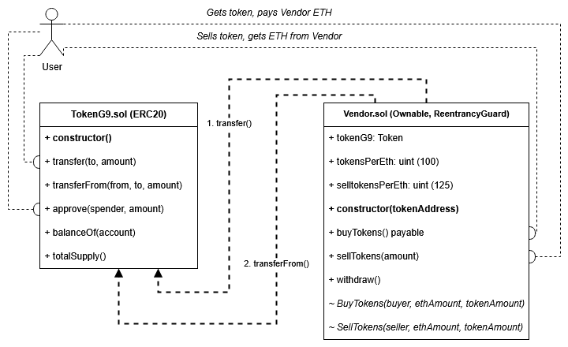

# Token Vendor dApp

An Ethereum-based dApp that allows users to buy and sell ERC-20 tokens in exchange for ETH using a vendor smart contract.

---

## 📦 Stack

- **Frontend**: Next.js 15, TailwindCSS, DaisyUI
- **Wallet Integration**: Reownkit + wagmi + viem
- **Smart Contracts**: Solidity, Hardhat, OpenZeppelin
- **Deployment**: Vercel (frontend), Sepolia testnet (contracts)

---

## 📸 Diagrams
[Placeholder]
### System Architecture  


### User Flow – Buy/Sell  


### Contract Interaction  


---

## 🚀 Features

- Buy tokens by sending ETH to `TokenVendor`
- Sell tokens to receive ETH back
- View token and ETH balances
- Real-time wallet integration via Reownkit

---

## 🧪 Local Development

```bash
# Install deps
yarn install

# Start local blockchain
yarn chain

# Deploy contracts
yarn deploy

# Start frontend
yarn dev

```

---

## 📄 Contracts

- `MyToken.sol` – Custom ERC-20 token
- `TokenVendor.sol` – Buys/sells token for ETH

Built and deployed using [Scaffold-ETH 2](https://github.com/scaffold-eth/scaffold-eth-2) template.

---

## ✍️ Author

Created and customized by Group 9  
Built with 💙 for the EVM Bootcamp

---

## License
MIT

