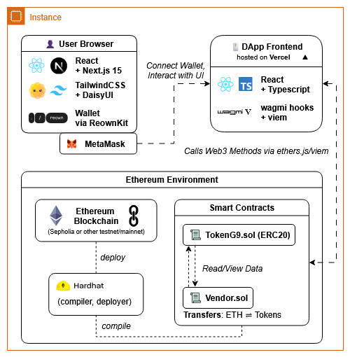

# Token Vendor dApp

[](https://opensource.org/licenses/agpl-v3)
[](https://soliditylang.org/)
[](https://reactjs.org/)
[](https://nodejs.org/)

An Ethereum-based decentralized application (dApp) that allows users to seamlessly **buy and sell ERC-20 tokens** (`Token G9`) in exchange for ETH using a vendor smart contract and an ERC-20 contract.


## 🌐 Live Demo
Please visit the live demo at [group9-evm.vercel.app](https://group9-evm.vercel.app/).


## 📦 Stack

- **Frontend**: Next.js 15, TailwindCSS, DaisyUI  
- **Wallet Integration**: Reownkit, wagmi, viem  
- **Smart Contracts**: Solidity, Hardhat, OpenZeppelin  
- **Deployment**: Vercel (frontend), Sepolia testnet (contracts)  


## 📸 Diagrams

### System Architecture  


### User Flow – Buy/Sell  


### Contract Interaction  


---

## 🚀 Features

- **Buy tokens** by sending ETH to the `Vendor` contract  
- **Sell tokens** back to the contract in exchange for ETH  
- **Real-time balances** for ETH and tokens  
- **Wallet integration** via Reownkit for seamless Web3 experience  

## 🧪 Local Development

Clone and install dependencies:

```bash
git clone https://github.com/segment7/token-vendor.git
cd token-vendor
yarn install
```

Run the local blockchain and deploy:
```bash
# Start local Hardhat chain
yarn chain

# Deploy contracts
yarn deploy
```

Start the frontend:
```bash
yarn start
```

Access at `http://localhost:3000`

## 📄 Contracts

- **TokenG9.sol** – Custom ERC-20 token, initial supply: 1000 G9 tokens
- **Vendor.sol** – Vendor contract with the following key functions:
  - `buyTokens()` (payable)
  - `sellTokens()`
  - `withdraw()` (owner only)

**Events:**
- `BuyTokens` (buyer, ethAmount, tokenAmount)
- `SellTokens` (seller, ethAmount, tokenAmount)

## 🙏 Acknowledgments

- [Scaffold-ETH 2](https://github.com/scaffold-eth/scaffold-eth-2) - Open-source Ethereum dapps toolkit

## ✍️ Author

Created and customized by **Group 9**  
Built with 💙 for the EVM Bootcamp  

## 📄 License

- [AGPL v3](https://opensource.org/licenses/agpl-v3)
